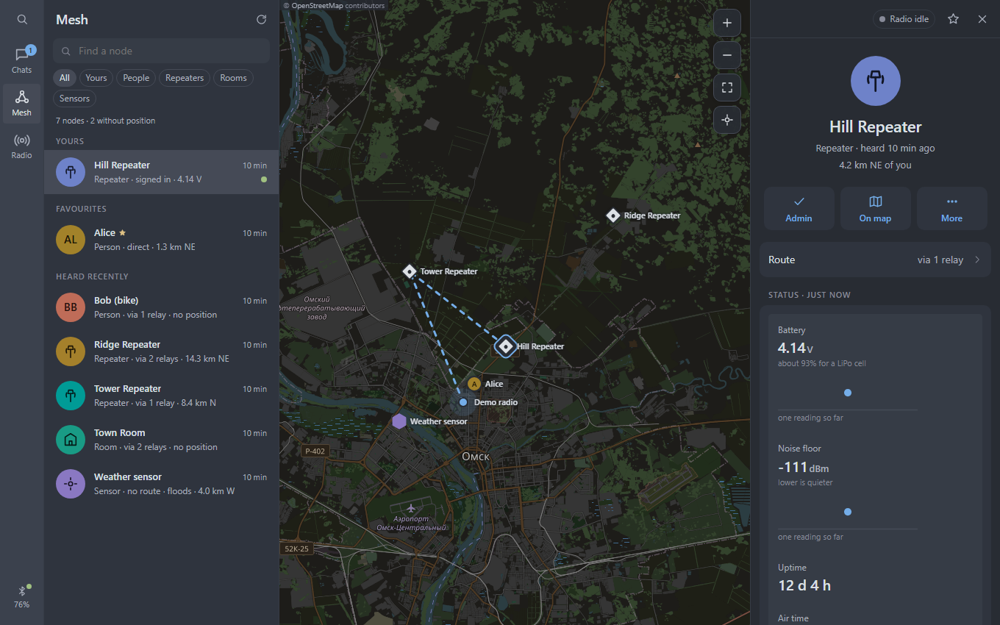
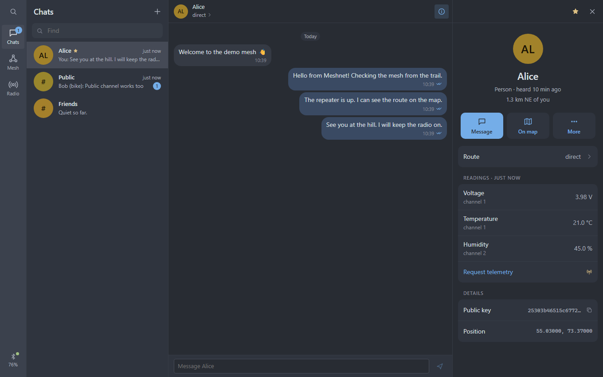
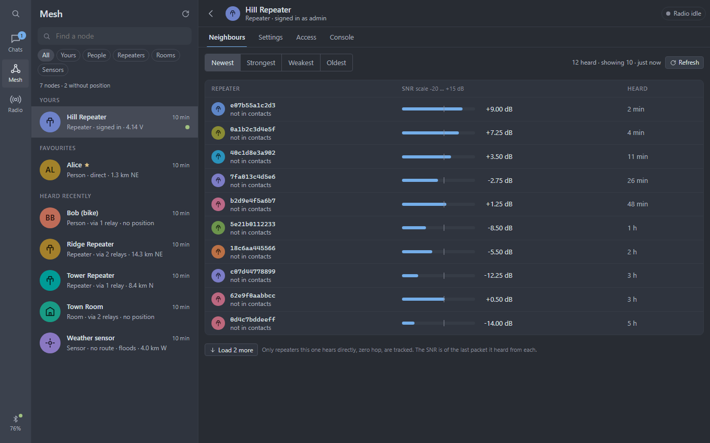
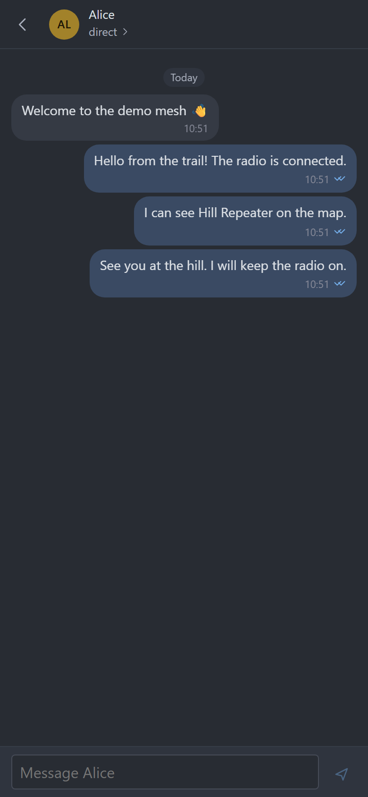
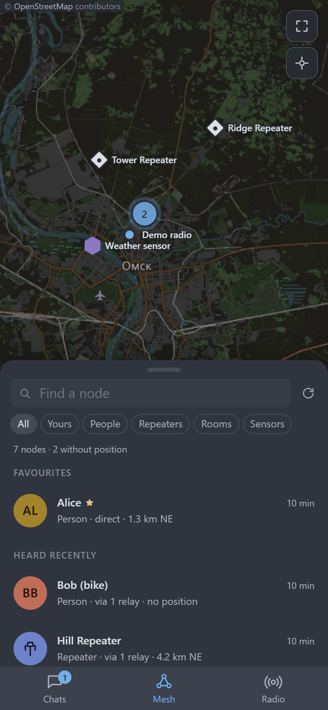
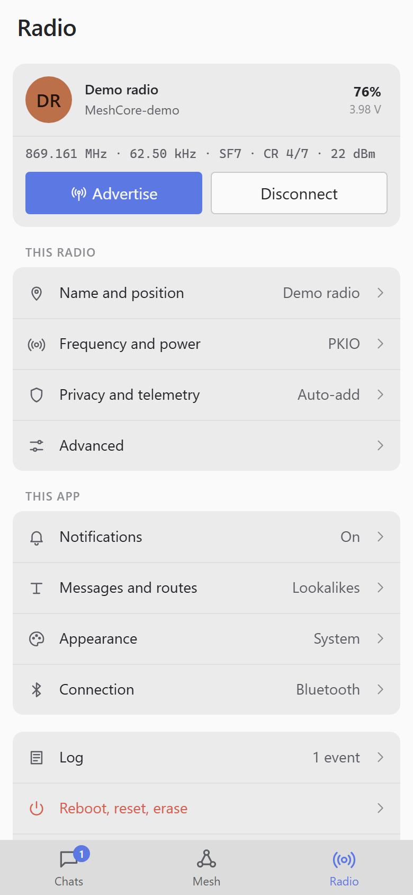

<div align="center">
  
  <h1>Meshnet</h1>
  <p><strong>Your mesh, in one place.</strong></p>
  <p>Chat, explore nearby nodes and manage your MeshCore radios.<br />On your desktop, in your browser and on your phone.</p>
  <p><strong>English</strong> · <a href="README.ru.md">Русский</a></p>
  <p>
    <a href="https://github.com/cm4ker/meshnet/actions/workflows/build.yml"></a>
    <a href="https://github.com/meshcore-dev/MeshCore"></a>
    <a href="https://github.com/cm4ker/meshnet/releases/tag/dev"></a>
  </p>
  <p><a href="#features">Features</a> · <a href="#screenshots">Screenshots</a> · <a href="#get-started">Get started</a> · <a href="#development">Development</a></p>
</div>



**Meshnet** is a companion client for [MeshCore](https://github.com/meshcore-dev/MeshCore) LoRa radios. Connect a compatible radio over **Bluetooth, USB or Wi-Fi** and exchange messages through the mesh without an internet connection for messaging. Conversations stay on your device; the radio carries them over the air.

The mobile app is named **Ommesh**. It shares the same client and features, with an interface adapted for a phone.

## Features

| Chats | Mesh | Radio |
| :--- | :--- | :--- |
| Direct messages, channels and rooms | People, repeaters and sensors on a map | Connection, radio settings and app preferences |
| Delivery status and message routes | Node profiles, telemetry and remote management | Frequency presets, notifications and diagnostics |

### Messages you can follow

- **Direct messages and channels.** Create or join channels with a name and a 128-bit key, talk in rooms and keep favourite contacts close.
- **Delivery feedback.** See sent, acknowledged, unconfirmed and failed messages, including acknowledgement round-trip time. Retry an unconfirmed message; a retry after an unacknowledged learned route uses a flood.
- **Message routes.** Inspect known relays, received copies and signal quality. Relay hashes resolve to contact names when the match is unambiguous.
- **Route controls.** Pin a contact to flood mode or set an expiry for learned routes, globally and per contact, so the next message can find a fresh path.
- **Local history.** Conversations are stored in IndexedDB, separately for each radio. Optional Cyrillic lookalike substitution saves bytes by replacing selected letters with visually identical Latin characters.

### See and manage the mesh

- **An interactive map.** Find nodes that share a position, see their distance and bearing, and follow known routes through located relays. Markers distinguish node types and fade as adverts age; nearby markers cluster together.
- **Cached maps.** OpenStreetMap tiles are saved as you view them, so previously viewed areas remain available without a network connection.
- **One profile per node.** Open it from a chat, the list or the map to view its route, read telemetry, rename it, add it to favourites or share it over the air.
- **Remote administration.** Sign in to repeaters, rooms and sensors through your radio. View status, a week's battery and noise-floor trends, repeater neighbours, access roles, settings and the console. Sensor history includes minimum, maximum and mean readings.
- **Visible radio traffic.** Remote requests run through a visible queue, one at a time. Actions that transmit are marked with an antenna; status refreshes are requested by you.

### At home on every screen

- **Desktop workspace.** Conversation list, chat and details side by side, with a command palette and keyboard shortcuts.
- **Windows updates.** Stable/Dev channels, optional automatic checks, signed downloads and installation on demand. Available even before connecting a radio; history and drafts are saved before restart.
- **Phone navigation.** Bottom tabs, a sliding node list over the map, long-press menus and swipe-back navigation.
- **Light and dark themes.** One Light, One Dark, system theme selection and adjustable text size.
- **Radio controls.** Name, position, frequency, bandwidth, spreading factor, coding rate, transmit power, contact and telemetry policies, clock, adverts and advanced tuning. Frequency changes have a separate Apply step; remote radio changes support a timed trial.
- **Notifications and diagnostics.** Message and newly discovered node notifications, an event log and optional raw frame inspection in hex.
- **Demo mode.** Explore the interface with simulated contacts, messages and nodes, without hardware.

## Screenshots

Actual captures of the web client in **demo mode**, at desktop and phone viewport sizes. Names, messages and readings are sample data; the phone captures show the responsive interface, without native system chrome.

<table>
  <tr>
    <td width="50%"><a href="docs/screenshots/desktop-chat.png"></a></td>
    <td width="50%"><a href="docs/screenshots/desktop-node.png"></a></td>
  </tr>
  <tr>
    <td align="center"><strong>Conversations and telemetry</strong><br />Messages, delivery feedback and contact details.</td>
    <td align="center"><strong>Remote node management</strong><br />Repeater neighbours and signal quality.</td>
  </tr>
</table>

<table>
  <tr>
    <td align="center" width="33%"><a href="docs/screenshots/mobile-chat.png"></a></td>
    <td align="center" width="33%"><a href="docs/screenshots/mobile-mesh.png"></a></td>
    <td align="center" width="33%"><a href="docs/screenshots/mobile-radio.png"></a></td>
  </tr>
  <tr>
    <td align="center"><strong>Chat on the go</strong></td>
    <td align="center"><strong>Explore the mesh</strong></td>
    <td align="center"><strong>Control your radio</strong></td>
  </tr>
</table>

## Get started

Download the [rolling development build](https://github.com/cm4ker/meshnet/releases/tag/dev) or browse [all releases](https://github.com/cm4ker/meshnet/releases).

| Platform | Bluetooth LE | USB serial | Wi-Fi / TCP | Build availability |
| :--- | :---: | :---: | :---: | :--- |
| Windows | ✓ | ✓ | ✓ | CI installers for x64 and ARM64 |
| macOS / Linux | ✓ | ✓ | ✓ | Build the Tauri shell from source |
| Android | ✓ | — | ✓ | CI debug APK; mobile app name: Ommesh |
| iOS | ✓ | — | ✓ | Build with Xcode on a Mac; see [mobile guide](apps/mobile/README.md) |
| Browser | Web Bluetooth¹ | Web Serial¹ | — | Web bundle or local development server |

¹ Browser connections depend on browser and OS support. Use Chrome or Edge where the relevant API is available. Wi-Fi connections require companion firmware built with Wi-Fi support; the default TCP port is `5000`.

1. Use a radio running **MeshCore companion firmware**.
2. Choose an available connection method and connect to the radio. For Bluetooth, enter its pairing PIN when prompted.
3. Meshnet loads contacts and channels and reads queued messages. Open **Chats** to talk, **Mesh** to explore and **Radio** to configure the device.

**No radio yet?** Run the web client below, open [localhost:5180/?demo](http://localhost:5180/?demo), select **Demo** and connect to **MeshCore-demo**.

The `dev` page links to the latest successful Dev release with Windows installers, a debug Android APK and the web bundle. Each build is kept separately; `vX.Y.Z` tags matching the root `package.json` version create stable releases. Pull request builds are available as workflow artifacts. iOS builds and TestFlight uploads are handled separately.

On Windows, open **App updates** on the connection screen, **Update** in the sidebar, or **Radio → About**. Checks run at startup and every six hours; downloading and installation are requested by you. Older versions without the updater need one manual installation. See [channels, signing and release setup](docs/desktop-updates.md).

## Development

Use **Node.js 24** (the version used in CI) and **pnpm 10.17.1** (pinned in `package.json`).

```sh
pnpm install
pnpm web
```

The client runs at **http://localhost:5180**. The protocol package is rebuilt automatically before the dev server starts.

| Command | Purpose |
| :--- | :--- |
| `pnpm typecheck` | Check TypeScript across the workspace |
| `pnpm test` | Run protocol, client and session tests without hardware |
| `pnpm build` | Build the shared protocol package and web client |
| `pnpm desktop` | Start the Tauri desktop app in development mode |
| `pnpm desktop:bundle` | Build a desktop installer |
| `pnpm android` | Build and sync the client, then open Android Studio |
| `pnpm ios` | Build and sync the client, then open Xcode on macOS |

Desktop builds need a Rust toolchain and the platform's native build tools. Installers are written under `apps/desktop/src-tauri/target/release/bundle`. Mobile builds need Android Studio / Android SDK or Xcode; see the [mobile guide](apps/mobile/README.md).

<details>
<summary><strong>Point a mobile development build at your local server</strong></summary>

Run `pnpm web`, then set `CAP_SERVER_URL` to your computer's LAN address when syncing the mobile shell.

```sh
# macOS / Linux
CAP_SERVER_URL="http://<your-lan-ip>:5180" pnpm mobile:sync
```

```powershell
# PowerShell
$env:CAP_SERVER_URL = "http://<your-lan-ip>:5180"
pnpm mobile:sync
Remove-Item Env:CAP_SERVER_URL
```

Omit this variable and sync again to bundle the client for use without a development server.

</details>

### Project structure

```text
packages/meshcore   Companion Radio Protocol, framing and sessions; no platform code
apps/web           Shared React + TypeScript client, built with Vite
apps/desktop       Tauri 2 shell for Windows, macOS and Linux
apps/mobile        Capacitor 8 shell for Android and iOS (Ommesh)
docs/screenshots   Demo captures used by both README translations
```

The client selects its transport at runtime. Desktop and mobile shells bundle the same web client and provide native connections, notifications and credential storage.

### Keyboard shortcuts

| Shortcut | Action |
| :--- | :--- |
| `Ctrl+K` | Open the command palette |
| `Alt+1` / `Alt+2` / `Alt+3` | Switch sections in the browser |
| `Ctrl+1` / `Ctrl+2` / `Ctrl+3` | Switch sections in the desktop shell |
| `Alt+↑` / `Alt+↓` | Move between chats |
| `Ctrl+I` | Toggle the details panel |
| `Esc` | Close a panel or go back |

## Protocol and hardware notes

<details>
<summary><strong>Protocol compatibility and local storage</strong></summary>

- Protocol opcodes and frame layouts follow MeshCore firmware's `examples/companion_radio/MyMesh.cpp`, **v1.17.1, protocol version 13**. The client announces protocol version **3**, which adds SNR to message frames. Unknown frames are logged rather than treated as fatal errors.
- Serial and TCP use `'<'` / `'>'` framing, a little-endian length and a payload. BLE sends one frame per write or notification over the Nordic UART service.
- Message history lives on the client, per radio. The radio retains only messages that have not yet been read.
- Remembered node passwords use the system credential store on desktop, secure storage on mobile and browser storage in the web client.

</details>

<details>
<summary><strong>Bluetooth pairing and USB firmware</strong></summary>

- **Windows:** the app handles PIN pairing for the encrypted UART service and can replace a stale bond after a radio reset or reflash. Its native GATT implementation reads the Windows characteristic cache after pairing.
- **nRF52 USB:** boards such as T-Echo, RAK4631 and Heltec T114 need the **`_usb` firmware build** for a USB connection. The `_ble` build's serial port does not carry the companion protocol.
- **Android:** the BLE plugin requests an MTU of 512 bytes; companion frames can be up to 176 bytes. The system pairing prompt handles the PIN.
- **iOS:** the shell enables `bluetooth-central` background mode to support the connection while switching apps.

</details>
